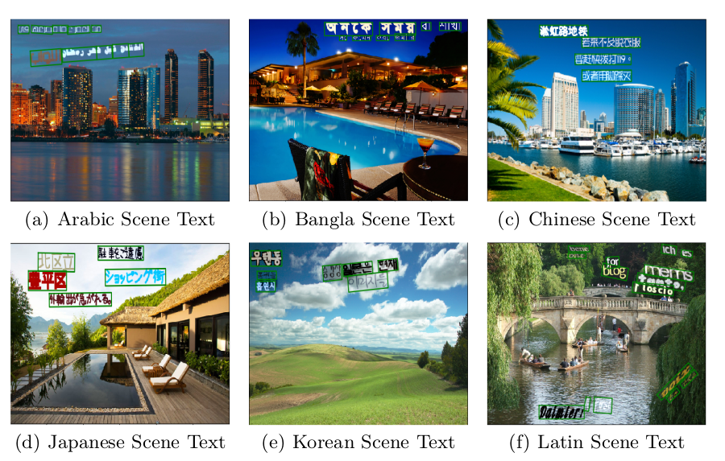

# E2E-MLT
 E2E-MLT - an Unconstrained End-to-End Method for Multi-Language Scene Text

code base for:  https://arxiv.org/abs/1801.09919


## Requirements

  - python3.x with
  - opencv-python
  - pytorch 0.4.1
  - torchvision
  - warp-ctc (https://github.com/SeanNaren/warp-ctc/)

## Pretrained Models

  [e2e-mlt](http://ptak.felk.cvut.cz/public_datasets/SyntText/e2e-mlt.h5)

```
wget http://ptak.felk.cvut.cz/public_datasets/SyntText/e2e-mlt.h5
```

## Running Demo

```
python3 demo.py -model=e2e-mlt.h5
```

## Data

 - [ICDAR MLT Dataset](http://rrc.cvc.uab.es/?ch=8&com=introduction)
 - [ICDAR 2015 Dataset](http://rrc.cvc.uab.es/?ch=4&com=introduction)
 - [RCTW-17](http://mclab.eic.hust.edu.cn/icdar2017chinese/)
 - Synthetic MLT Data ([Arabic](http://ptak.felk.cvut.cz/public_datasets/SyntText/Arabic.zip), [Bangla](http://ptak.felk.cvut.cz/public_datasets/SyntText/Bangla.zip), [Chinese](http://ptak.felk.cvut.cz/public_datasets/SyntText/Chinese.zip), [Japanese](http://ptak.felk.cvut.cz/public_datasets/SyntText/Japanese.zip), [Korean](http://ptak.felk.cvut.cz/public_datasets/SyntText/Korean.zip), [Latin](http://ptak.felk.cvut.cz/public_datasets/SyntText/Latin.zip)   )



Synthetic text has been generated using [Synthetic Data for Text Localisation in Natural Images](https://github.com/ankush-me/SynthText), with minor changes for Arabic and Bangla script rendering.

What we have found useful:
 - for generating Arabic Scene Text: https://github.com/mpcabd/python-arabic-reshaper
 - for generating Bangla Scene Text: PyQt4
 - having somebody who can read non-latin scripts: we would like to thank Ali Anas for reviewing generated Arabic scene text.


## Trainnig

```
python3 train.py -train_list=sample_train_data/MLT/trainMLT.txt -batch_size=8 -num_readers=5 -debug=0 -input_size=512 -ocr_batch_size=256 -ocr_feed_list=sample_train_data/MLT_CROPS/gt.txt
```

## Acknowledgments

 Code borrows from [EAST](https://github.com/argman/EAST) and [DeepTextSpotter](https://github.com/MichalBusta/DeepTextSpotter)

## TODO
 - update arxiv with current paper status
